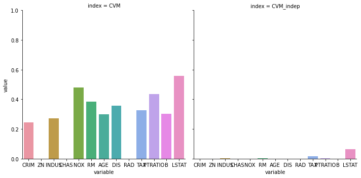
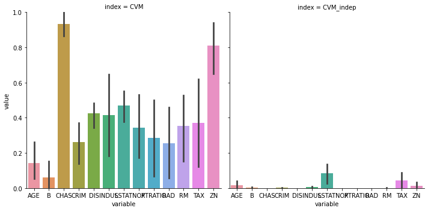
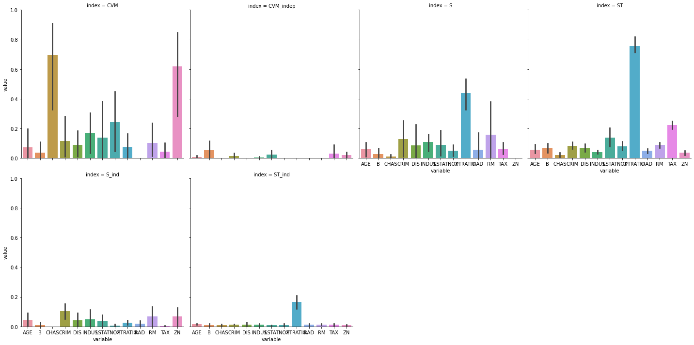
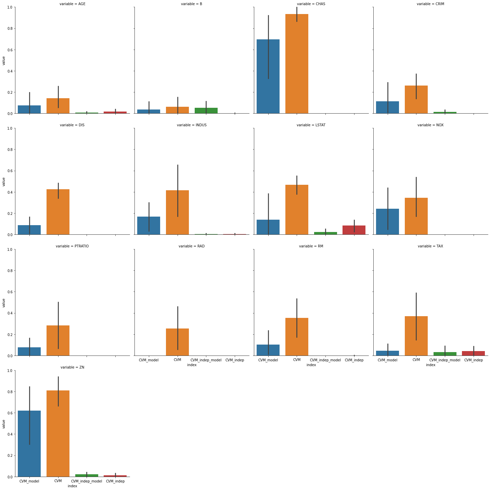
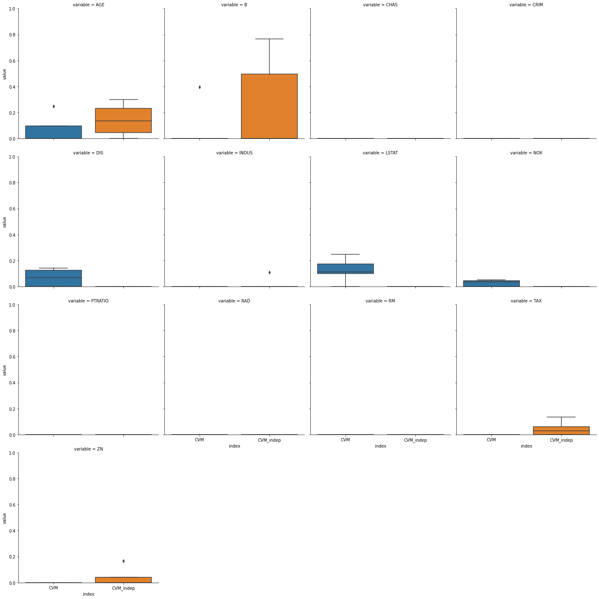

Demo: Fairness on regression problems
-------------------------------------

.. code:: ipython3

    import matplotlib.pyplot as plt
    import numpy as np
    import pandas as pd
    from libfairness.data_management.factory import from_numpy, from_pandas
    from libfairness.data_management.processing import one_hot_encode
    from libfairness.indices.confidence_intervals import with_confidence_intervals
    from libfairness.indices.cvm import cvm_indices
    from libfairness.indices.standard_metrics import disparate_impact
    from libfairness.indices.sobol import sobol_indices
    from libfairness.utils.dataclasses import IndicesInput, IndicesOutput
    from libfairness.utils.fairness_objective import y_true, squared_error, y_pred
    from libfairness.visualization.plots import cat_plot
    from libfairness.visualization.text import format_with_intervals
    from sklearn.ensemble import RandomForestRegressor
    from sklearn.metrics import accuracy_score
    from sklearn.datasets import load_boston
    from sklearn.model_selection import train_test_split

I) Study of the intrinsic fairness of the dataset
~~~~~~~~~~~~~~~~~~~~~~~~~~~~~~~~~~~~~~~~~~~~~~~~~

data wrangling
^^^^^^^^^^^^^^

in this notebook we will work on the boston housing dataset.

First we will start with computing some indices on the training data to
see if the dataset is biased. The first step consist of building the
IndicesInput object that stores the data. As we can set the target
``y_true`` means that we analyse the data, but this can be set to
``y_pred`` if we want to analyse predictions, or ``squared_error`` if we
want to analyse the error. This parameter can be changer afterward.

.. code:: ipython3

    data = load_boston()
    # construct IndicesInput object
    indices_inputs = from_numpy(
        x=data.data,
        y=data.target,
        feature_names=data.feature_names,
        target=y_true,
    )
    indices_inputs.x.head()

.. raw:: html

    

    
    <table border="1" class="dataframe">
      <thead>
        <tr style="text-align: right;">
          <th></th>
          <th>CRIM</th>
          <th>ZN</th>
          <th>INDUS</th>
          <th>CHAS</th>
          <th>NOX</th>
          <th>RM</th>
          <th>AGE</th>
          <th>DIS</th>
          <th>RAD</th>
          <th>TAX</th>
          <th>PTRATIO</th>
          <th>B</th>
          <th>LSTAT</th>
        </tr>
      </thead>
      <tbody>
        <tr>
          <th>0</th>
          <td>0.00632</td>
          <td>18.0</td>
          <td>2.31</td>
          <td>0.0</td>
          <td>0.538</td>
          <td>6.575</td>
          <td>65.2</td>
          <td>4.0900</td>
          <td>1.0</td>
          <td>296.0</td>
          <td>15.3</td>
          <td>396.90</td>
          <td>4.98</td>
        </tr>
        <tr>
          <th>1</th>
          <td>0.02731</td>
          <td>0.0</td>
          <td>7.07</td>
          <td>0.0</td>
          <td>0.469</td>
          <td>6.421</td>
          <td>78.9</td>
          <td>4.9671</td>
          <td>2.0</td>
          <td>242.0</td>
          <td>17.8</td>
          <td>396.90</td>
          <td>9.14</td>
        </tr>
        <tr>
          <th>2</th>
          <td>0.02729</td>
          <td>0.0</td>
          <td>7.07</td>
          <td>0.0</td>
          <td>0.469</td>
          <td>7.185</td>
          <td>61.1</td>
          <td>4.9671</td>
          <td>2.0</td>
          <td>242.0</td>
          <td>17.8</td>
          <td>392.83</td>
          <td>4.03</td>
        </tr>
        <tr>
          <th>3</th>
          <td>0.03237</td>
          <td>0.0</td>
          <td>2.18</td>
          <td>0.0</td>
          <td>0.458</td>
          <td>6.998</td>
          <td>45.8</td>
          <td>6.0622</td>
          <td>3.0</td>
          <td>222.0</td>
          <td>18.7</td>
          <td>394.63</td>
          <td>2.94</td>
        </tr>
        <tr>
          <th>4</th>
          <td>0.06905</td>
          <td>0.0</td>
          <td>2.18</td>
          <td>0.0</td>
          <td>0.458</td>
          <td>7.147</td>
          <td>54.2</td>
          <td>6.0622</td>
          <td>3.0</td>
          <td>222.0</td>
          <td>18.7</td>
          <td>396.90</td>
          <td>5.33</td>
        </tr>
      </tbody>
    </table>
    

We can then apply preprocessing such as one_hot encoding.

.. code:: ipython3

    # apply one hot encoding
    indices_inputs = one_hot_encode(indices_inputs, ["CHAS", "RAD"])

indices computation: CVM
^^^^^^^^^^^^^^^^^^^^^^^^

As we have a regression problem, we use the CVM indices to compute
sensitvity analysis.

We then declare the indices computation functions. The results are
stored in a ``indicesOuput`` object. raw value can be acessed with
``.values``, Please note that 0 refers to total independence and 1
refers to total dependence.

.. code:: ipython3

    indices_outputs = cvm_indices(indices_inputs)
    indices_outputs.values

.. raw:: html

    

    
    <table border="1" class="dataframe">
      <thead>
        <tr style="text-align: right;">
          <th></th>
          <th>CVM</th>
          <th>CVM_indep</th>
        </tr>
      </thead>
      <tbody>
        <tr>
          <th>AGE</th>
          <td>0.300932</td>
          <td>0.000000</td>
        </tr>
        <tr>
          <th>B</th>
          <td>0.302174</td>
          <td>0.000000</td>
        </tr>
        <tr>
          <th>CHAS</th>
          <td>0.000000</td>
          <td>0.000000</td>
        </tr>
        <tr>
          <th>CRIM</th>
          <td>0.243869</td>
          <td>0.000000</td>
        </tr>
        <tr>
          <th>DIS</th>
          <td>0.357619</td>
          <td>0.000000</td>
        </tr>
        <tr>
          <th>INDUS</th>
          <td>0.272787</td>
          <td>0.001875</td>
        </tr>
        <tr>
          <th>LSTAT</th>
          <td>0.558240</td>
          <td>0.063952</td>
        </tr>
        <tr>
          <th>NOX</th>
          <td>0.478985</td>
          <td>0.000000</td>
        </tr>
        <tr>
          <th>PTRATIO</th>
          <td>0.435468</td>
          <td>0.001031</td>
        </tr>
        <tr>
          <th>RAD</th>
          <td>0.000000</td>
          <td>0.000000</td>
        </tr>
        <tr>
          <th>RM</th>
          <td>0.384756</td>
          <td>0.001851</td>
        </tr>
        <tr>
          <th>TAX</th>
          <td>0.328209</td>
          <td>0.017599</td>
        </tr>
        <tr>
          <th>ZN</th>
          <td>0.000000</td>
          <td>0.000000</td>
        </tr>
      </tbody>
    </table>
    

We can now plot those easily using the approriate function from the
``visualization`` module. The two main parameters are ``plot_per`` and
``kind``:

-  plot_per (str): can be either ``variable`` or ``index``, when set to
   ``variable`` there is one graph per variable, each graph showing the
   values of all indices. Respectively setting to ``index`` will build
   one graph per index, each showing the values for all variable.
-  kind (str): kind of visualization to produce, can be one of
   ``strip``, ``swarm``, ``box``, ``violin``, ``boxen``, ``point``,
   ``bar``.

feel free to play with it !

.. code:: ipython3

    cat_plot(indices_outputs, plot_per="index", kind="bar")

.. parsed-literal::

    <seaborn.axisgrid.FacetGrid at 0x2ad1e7c0408>

confidence intervals
^^^^^^^^^^^^^^^^^^^^

It is also possible to decorate any indice function with
``with_confidence_intervals`` to use bootstrapping to compute confidence
intervals. We can also use the + operator to compute multiple indices
simulteanously. Results with confidence intervals can be visualized
either textually with ``format_with_intervals`` or ’graphically with
``cat_plot``

.. code:: ipython3

    cvm_with_ci = with_confidence_intervals(n_splits=5)(cvm_indices)
    indices_outputs_ci = cvm_with_ci(indices_inputs)
    format_with_intervals(indices_outputs_ci, quantile=0.05)

.. parsed-literal::

    100%|█████████████████████████████████████████████| 5/5 [00:01<00:00,  4.96it/s]
    

.. raw:: html

    

    
    <table border="1" class="dataframe">
      <thead>
        <tr style="text-align: right;">
          <th></th>
          <th>CVM</th>
          <th>CVM_indep</th>
        </tr>
      </thead>
      <tbody>
        <tr>
          <th>AGE</th>
          <td>0.13 [0.01, 0.32]</td>
          <td>0.00 [0.00, 0.05]</td>
        </tr>
        <tr>
          <th>B</th>
          <td>0.00 [0.00, 0.20]</td>
          <td>0.00 [0.00, 0.01]</td>
        </tr>
        <tr>
          <th>CHAS</th>
          <td>1.00 [0.83, 1.00]</td>
          <td>0.00 [0.00, 0.00]</td>
        </tr>
        <tr>
          <th>CRIM</th>
          <td>0.26 [0.07, 0.40]</td>
          <td>0.00 [0.00, 0.00]</td>
        </tr>
        <tr>
          <th>DIS</th>
          <td>0.44 [0.30, 0.50]</td>
          <td>0.00 [0.00, 0.00]</td>
        </tr>
        <tr>
          <th>INDUS</th>
          <td>0.58 [0.06, 0.69]</td>
          <td>0.00 [0.00, 0.01]</td>
        </tr>
        <tr>
          <th>LSTAT</th>
          <td>0.53 [0.34, 0.57]</td>
          <td>0.12 [0.00, 0.15]</td>
        </tr>
        <tr>
          <th>NOX</th>
          <td>0.20 [0.15, 0.63]</td>
          <td>0.00 [0.00, 0.00]</td>
        </tr>
        <tr>
          <th>PTRATIO</th>
          <td>0.34 [0.00, 0.61]</td>
          <td>0.00 [0.00, 0.00]</td>
        </tr>
        <tr>
          <th>RAD</th>
          <td>0.29 [0.00, 0.59]</td>
          <td>0.00 [0.00, 0.00]</td>
        </tr>
        <tr>
          <th>RM</th>
          <td>0.39 [0.06, 0.60]</td>
          <td>0.00 [0.00, 0.00]</td>
        </tr>
        <tr>
          <th>TAX</th>
          <td>0.48 [0.03, 0.68]</td>
          <td>0.01 [0.00, 0.11]</td>
        </tr>
        <tr>
          <th>ZN</th>
          <td>0.88 [0.57, 0.99]</td>
          <td>0.00 [0.00, 0.04]</td>
        </tr>
      </tbody>
    </table>
    

.. code:: ipython3

    cat_plot(indices_outputs_ci, plot_per="index", kind="bar")

.. parsed-literal::

    <seaborn.axisgrid.FacetGrid at 0x2ad1f12ff88>

II) train a model and analyse it’s sensitivity
~~~~~~~~~~~~~~~~~~~~~~~~~~~~~~~~~~~~~~~~~~~~~~

train the model
^^^^^^^^^^^^^^^

first we will split the data and then train a basic model on it.

.. code:: ipython3

    X_train, X_test, y_train, y_test = train_test_split(data.data, data.target, test_size=0.2, random_state=42)

similarly we build the ``IndiceInput`` object

.. code:: ipython3

    indices_inputs_train = from_numpy(
        x=X_train,
        y=y_train,
        feature_names=data.feature_names,
    )
    indices_inputs_train = one_hot_encode(indices_inputs_train, ["CHAS", "RAD"])
    indices_inputs_test = from_numpy(
        x=X_test,
        y=y_test,
        feature_names=data.feature_names,
    )
    indices_inputs_test = one_hot_encode(indices_inputs_test, ["CHAS", "RAD"])

then we train a basic model: DecisionTree. Note that this analysis can
be applied to any callable that can handle numpy array as inputs.

.. code:: ipython3

    model = RandomForestRegressor(250, max_depth=5, min_samples_leaf=3)
    model.fit(indices_inputs_train.x, indices_inputs_train.y_true)
    train_score = model.score(indices_inputs_train.x, indices_inputs_train.y_true)
    val_score = model.score(indices_inputs_test.x, indices_inputs_test.y_true)
    print(f"train score: {train_score}, val score {val_score}")

.. parsed-literal::

    C:\Users\thibaut.boissin\AppData\Local\Continuum\anaconda3\envs\global_sensitivity_analysis_fairness\lib\site-packages\ipykernel_launcher.py:2: DataConversionWarning: A column-vector y was passed when a 1d array was expected. Please change the shape of y to (n_samples,), for example using ravel().
      
    

.. parsed-literal::

    train score: 0.9154398930928861, val score 0.8474730667767555
    

compute indices
^^^^^^^^^^^^^^^

we set the model and the objective

.. code:: ipython3

    indices_inputs_train.model = model.predict
    indices_inputs_train._objective = y_pred
    indices_inputs_test.model = model.predict
    indices_inputs_test._objective = y_pred

.. code:: ipython3

    cvm_with_ci = with_confidence_intervals(n_splits=5)(cvm_indices)
    sobol_with_ci = with_confidence_intervals(n_splits=5)(sobol_indices)
    indices_outputs_train = cvm_with_ci(indices_inputs_train) + sobol_with_ci(indices_inputs_train)
    format_with_intervals(indices_outputs_train, quantile=0.1)

.. parsed-literal::

    100%|█████████████████████████████████████████████| 5/5 [00:01<00:00,  4.64it/s]
    100%|█████████████████████████████████████████████| 5/5 [00:26<00:00,  5.31s/it]
    

.. raw:: html

    

    
    <table border="1" class="dataframe">
      <thead>
        <tr style="text-align: right;">
          <th></th>
          <th>CVM</th>
          <th>CVM_indep</th>
          <th>S</th>
          <th>ST</th>
          <th>S_ind</th>
          <th>ST_ind</th>
        </tr>
      </thead>
      <tbody>
        <tr>
          <th>AGE</th>
          <td>0.00 [0.00, 0.21]</td>
          <td>0.00 [0.00, 0.02]</td>
          <td>0.06 [0.00, 0.12]</td>
          <td>0.04 [0.03, 0.09]</td>
          <td>0.03 [0.00, 0.10]</td>
          <td>0.01 [0.01, 0.02]</td>
        </tr>
        <tr>
          <th>B</th>
          <td>0.00 [0.00, 0.11]</td>
          <td>0.00 [0.00, 0.14]</td>
          <td>0.00 [0.00, 0.07]</td>
          <td>0.07 [0.03, 0.11]</td>
          <td>0.00 [0.00, 0.03]</td>
          <td>0.00 [0.00, 0.02]</td>
        </tr>
        <tr>
          <th>CHAS</th>
          <td>0.85 [0.31, 0.94]</td>
          <td>0.00 [0.00, 0.00]</td>
          <td>0.00 [0.00, 0.03]</td>
          <td>0.01 [0.01, 0.04]</td>
          <td>0.00 [0.00, 0.00]</td>
          <td>0.01 [0.00, 0.02]</td>
        </tr>
        <tr>
          <th>CRIM</th>
          <td>0.06 [0.00, 0.29]</td>
          <td>0.01 [0.00, 0.04]</td>
          <td>0.04 [0.00, 0.30]</td>
          <td>0.08 [0.06, 0.11]</td>
          <td>0.11 [0.03, 0.17]</td>
          <td>0.01 [0.01, 0.02]</td>
        </tr>
        <tr>
          <th>DIS</th>
          <td>0.02 [0.01, 0.21]</td>
          <td>0.00 [0.00, 0.00]</td>
          <td>0.01 [0.00, 0.24]</td>
          <td>0.06 [0.03, 0.11]</td>
          <td>0.01 [0.00, 0.11]</td>
          <td>0.01 [0.00, 0.03]</td>
        </tr>
        <tr>
          <th>INDUS</th>
          <td>0.17 [0.00, 0.35]</td>
          <td>0.00 [0.00, 0.01]</td>
          <td>0.12 [0.03, 0.17]</td>
          <td>0.04 [0.03, 0.06]</td>
          <td>0.03 [0.00, 0.12]</td>
          <td>0.01 [0.01, 0.02]</td>
        </tr>
        <tr>
          <th>LSTAT</th>
          <td>0.00 [0.00, 0.40]</td>
          <td>0.00 [0.00, 0.06]</td>
          <td>0.05 [0.01, 0.21]</td>
          <td>0.12 [0.07, 0.22]</td>
          <td>0.02 [0.00, 0.08]</td>
          <td>0.01 [0.01, 0.01]</td>
        </tr>
        <tr>
          <th>NOX</th>
          <td>0.09 [0.03, 0.53]</td>
          <td>0.00 [0.00, 0.00]</td>
          <td>0.07 [0.00, 0.10]</td>
          <td>0.07 [0.05, 0.12]</td>
          <td>0.00 [0.00, 0.02]</td>
          <td>0.00 [0.00, 0.02]</td>
        </tr>
        <tr>
          <th>PTRATIO</th>
          <td>0.00 [0.00, 0.20]</td>
          <td>0.00 [0.00, 0.00]</td>
          <td>0.42 [0.31, 0.57]</td>
          <td>0.73 [0.71, 0.83]</td>
          <td>0.03 [0.01, 0.05]</td>
          <td>0.14 [0.11, 0.23]</td>
        </tr>
        <tr>
          <th>RAD</th>
          <td>0.00 [0.00, 0.00]</td>
          <td>0.00 [0.00, 0.00]</td>
          <td>0.00 [0.00, 0.17]</td>
          <td>0.04 [0.03, 0.07]</td>
          <td>0.02 [0.00, 0.04]</td>
          <td>0.02 [0.00, 0.02]</td>
        </tr>
        <tr>
          <th>RM</th>
          <td>0.07 [0.00, 0.25]</td>
          <td>0.00 [0.00, 0.00]</td>
          <td>0.00 [0.00, 0.42]</td>
          <td>0.09 [0.06, 0.11]</td>
          <td>0.01 [0.00, 0.17]</td>
          <td>0.01 [0.01, 0.02]</td>
        </tr>
        <tr>
          <th>TAX</th>
          <td>0.00 [0.00, 0.12]</td>
          <td>0.00 [0.00, 0.09]</td>
          <td>0.05 [0.01, 0.11]</td>
          <td>0.22 [0.20, 0.25]</td>
          <td>0.00 [0.00, 0.01]</td>
          <td>0.01 [0.01, 0.02]</td>
        </tr>
        <tr>
          <th>ZN</th>
          <td>0.77 [0.24, 0.88]</td>
          <td>0.01 [0.00, 0.05]</td>
          <td>0.00 [0.00, 0.00]</td>
          <td>0.02 [0.02, 0.06]</td>
          <td>0.04 [0.00, 0.15]</td>
          <td>0.01 [0.00, 0.01]</td>
        </tr>
      </tbody>
    </table>
    

.. code:: ipython3

    cat_plot(indices_outputs_train, plot_per="index", kind="bar", col_wrap=4)

.. parsed-literal::

    <seaborn.axisgrid.FacetGrid at 0x2ad1f2fd548>

compare indices from ``target=y_true`` with indices from ``target=y_pred``
^^^^^^^^^^^^^^^^^^^^^^^^^^^^^^^^^^^^^^^^^^^^^^^^^^^^^^^^^^^^^^^^^^^^^^^^^^

OK, these results are interesting but we would like to compare the
indices obtained with ``target=y_true``.

.. code:: ipython3

    merged_indices = indices_outputs_ci.runs
    merged_indices[["CVM_model", "CVM_indep_model"]] = indices_outputs_train.runs[["CVM", "CVM_indep"]]
    merged_indices = IndicesOutput(merged_indices[["CVM_model", "CVM", "CVM_indep_model", "CVM_indep"]])

.. code:: ipython3

    cat_plot(merged_indices, plot_per="variable", kind="bar", col_wrap=4)

.. parsed-literal::

    <seaborn.axisgrid.FacetGrid at 0x2ad23154d48>

As we can see the model tend to increase the influence of many variables

III) Analysis of the sensitivity of the error
~~~~~~~~~~~~~~~~~~~~~~~~~~~~~~~~~~~~~~~~~~~~~

Now we want to see if some variable are influent with the error of
model.

.. code:: ipython3

    indices_inputs_train._objective = squared_error
    indices_inputs_test._objective = squared_error

.. code:: ipython3

    cvm_with_ci = with_confidence_intervals(n_splits=5)(cvm_indices)
    indices_outputs_error_test = cvm_with_ci(indices_inputs_test)
    format_with_intervals(indices_outputs_error_test, quantile=0.1)

.. parsed-literal::

    100%|█████████████████████████████████████████████| 5/5 [00:01<00:00,  4.39it/s]
    

.. raw:: html

    

    
    <table border="1" class="dataframe">
      <thead>
        <tr style="text-align: right;">
          <th></th>
          <th>CVM</th>
          <th>CVM_indep</th>
        </tr>
      </thead>
      <tbody>
        <tr>
          <th>AGE</th>
          <td>0.00 [0.00, 0.19]</td>
          <td>0.14 [0.02, 0.27]</td>
        </tr>
        <tr>
          <th>B</th>
          <td>0.00 [0.00, 0.24]</td>
          <td>0.00 [0.00, 0.66]</td>
        </tr>
        <tr>
          <th>CHAS</th>
          <td>0.00 [0.00, 0.00]</td>
          <td>0.00 [0.00, 0.00]</td>
        </tr>
        <tr>
          <th>CRIM</th>
          <td>0.00 [0.00, 0.00]</td>
          <td>0.00 [0.00, 0.00]</td>
        </tr>
        <tr>
          <th>DIS</th>
          <td>0.07 [0.00, 0.14]</td>
          <td>0.00 [0.00, 0.00]</td>
        </tr>
        <tr>
          <th>INDUS</th>
          <td>0.00 [0.00, 0.00]</td>
          <td>0.00 [0.00, 0.07]</td>
        </tr>
        <tr>
          <th>LSTAT</th>
          <td>0.11 [0.04, 0.22]</td>
          <td>0.00 [0.00, 0.00]</td>
        </tr>
        <tr>
          <th>NOX</th>
          <td>0.04 [0.00, 0.05]</td>
          <td>0.00 [0.00, 0.00]</td>
        </tr>
        <tr>
          <th>PTRATIO</th>
          <td>0.00 [0.00, 0.00]</td>
          <td>0.00 [0.00, 0.00]</td>
        </tr>
        <tr>
          <th>RAD</th>
          <td>0.00 [0.00, 0.00]</td>
          <td>0.00 [0.00, 0.00]</td>
        </tr>
        <tr>
          <th>RM</th>
          <td>0.00 [0.00, 0.00]</td>
          <td>0.00 [0.00, 0.00]</td>
        </tr>
        <tr>
          <th>TAX</th>
          <td>0.00 [0.00, 0.00]</td>
          <td>0.03 [0.00, 0.11]</td>
        </tr>
        <tr>
          <th>ZN</th>
          <td>0.00 [0.00, 0.00]</td>
          <td>0.00 [0.00, 0.12]</td>
        </tr>
      </tbody>
    </table>
    

.. code:: ipython3

    cat_plot(indices_outputs_error_test, plot_per="variable", kind="box", col_wrap=4)

.. parsed-literal::

    <seaborn.axisgrid.FacetGrid at 0x2ad23fc5448>

